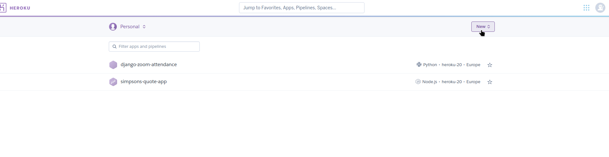

# Express Cheat Sheet

- Heroku is a cloud platform used to deploy our Express backend server on it to share it and access it from anywhere.

- Basically like github pages but strictly for backend applications.

___

## Steps to use

1. Create a [heroku](https://id.heroku.com/login/) account.

___

## Creating your heroku APP

- Once you login into your account you will be redirected to the dashboard.
- In your dashboard you will be able to create and view apps.

- After that add your app name, choose the region europe and then create your app.

- After that, you will be redirected to the Deploy tab.
- Connect your heroku app with your github account

- Once you're connected search for your repo name, choose it and then deploy it after wards.
- You can enable automatic deploys to automatically deploy the app once changes are pushed to that connected github repo.

___

## Extra configuration

- To add env variables to your heroku app:
  - under the settings tab go to config vars, reveal config var button and you should see where to add your variables.

  

___
