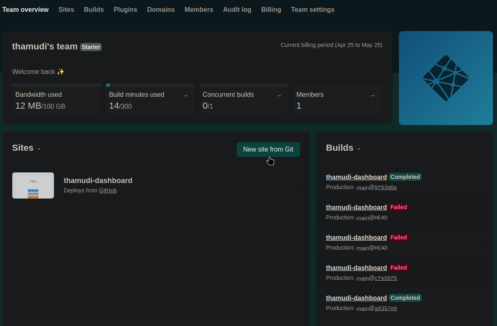
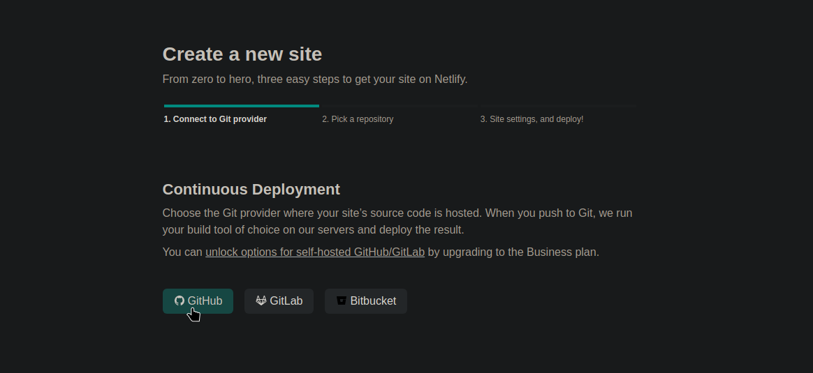
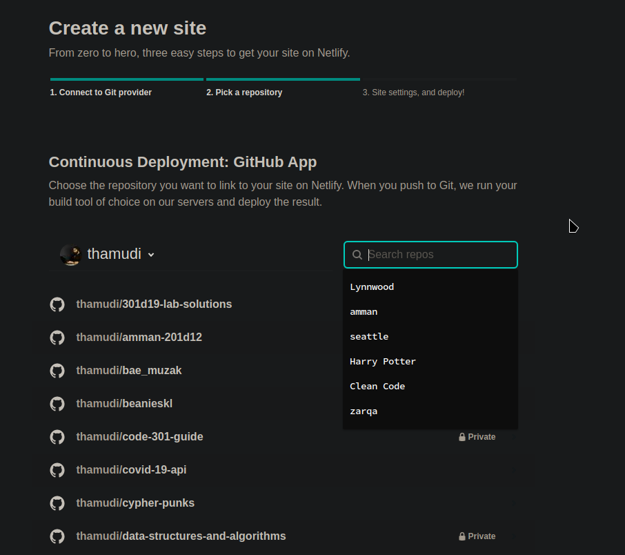
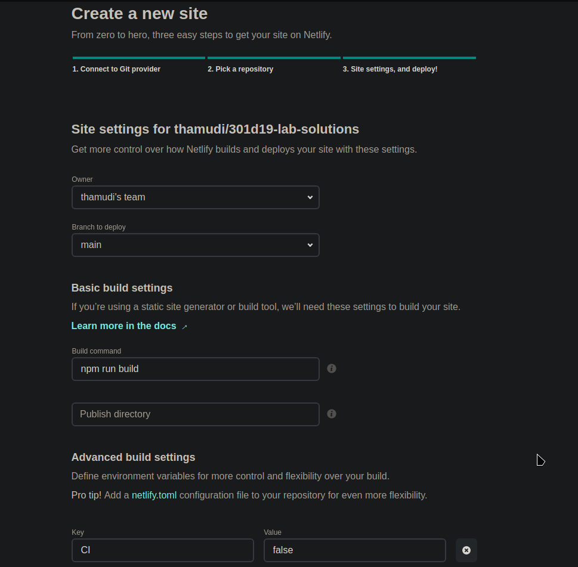
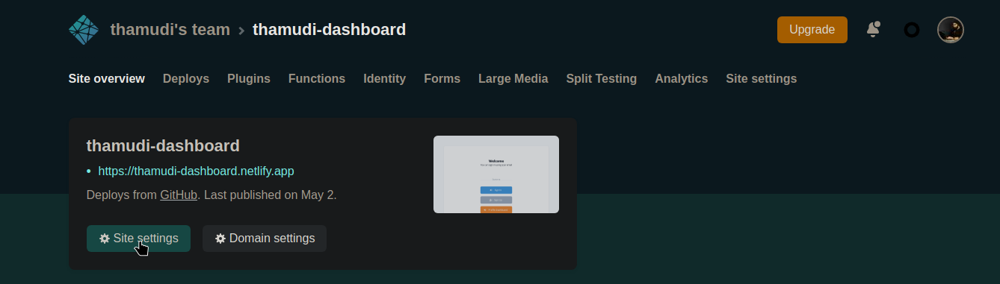
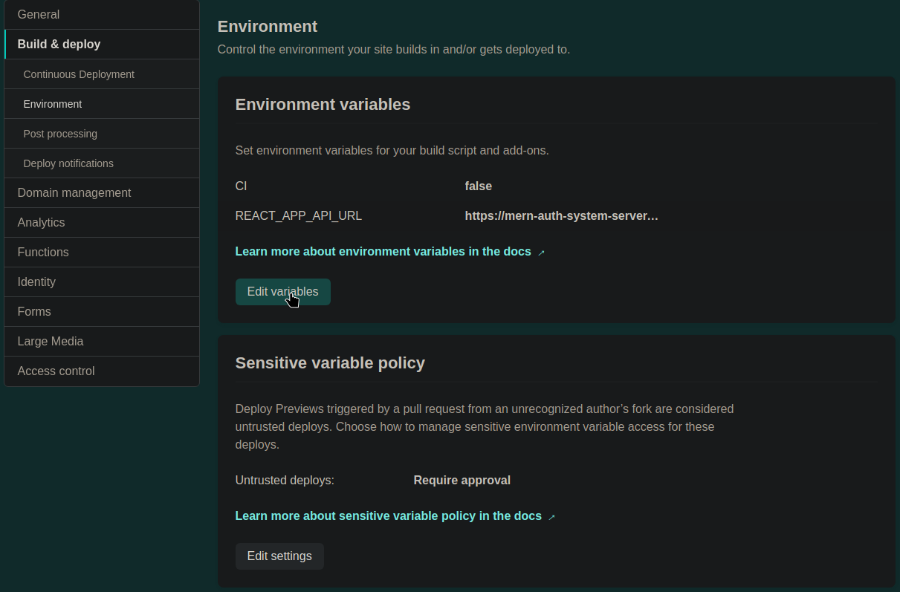

# Netlify Cheat Sheet

- Netlify is a cloud platform used to deploy our react apps on it to share it and access it from anywhere.

- Basically like github pages but mainly for react application.

___

## Steps to use

1. Create a [Netlify](https://www.netlify.com/) account using your github account.
2. Connect your github account to netlify.

___

## Steps to deploy an app

1. In your Team Overview choose "New Site from Git"

2. Choose the github option

3. Choose the repo you want to deploy

4. At this point you will need to do some configuration:
    1. Under "Basic build settings" make sure to:
        - set the build command to: `npm run build`
        - publish directory would be the directory containing your react app.
    2. Under Advanced build settings click show advanced and:
        - Create a new variable named `CI` and set the value to `false`

And you should be done! That's it!
___

## Extra configuration

- After you deploy your site you can visit Site settings after choosing your site from your Teams overview.

- Here you can modify or reconfigure your deployed sites settings.

- If you want to add more env variables to your deployed app:
  - Under site settings > go to Build and Deploy > Environment
  - You can now edit, add or remove variables.

___
